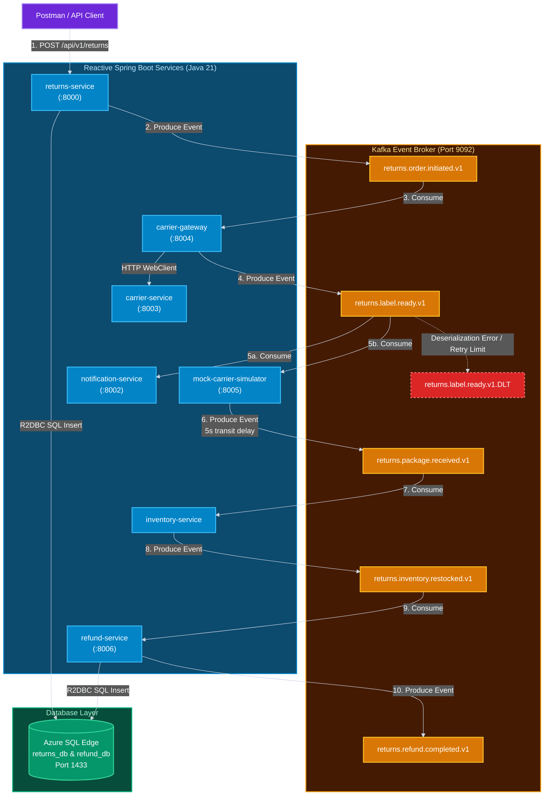

```mermaid
%%{init: {'theme': 'dark', 'themeVariables': { 'lineColor': '#cbd5e1', 'textColor': '#f8fafc', 'mainBkg': '#1e293b' }}}%%
flowchart TD
%% Node Class Styling (Dark Mode Optimized)
    classDef client fill:#6d28d9,stroke:#a78bfa,color:#ffffff,stroke-width:2px
    classDef service fill:#0284c7,stroke:#38bdf8,color:#ffffff,stroke-width:2px
    classDef topic fill:#d97706,stroke:#fbbf24,color:#ffffff,stroke-width:2px
    classDef db fill:#059669,stroke:#34d399,color:#ffffff,stroke-width:2px
    classDef dlt fill:#dc2626,stroke:#f87171,color:#ffffff,stroke-width:2px,stroke-dasharray: 4 4

    Client["Postman / API Client"]

    subgraph DB_Cluster["Database Layer"]
        SQLServer[("Azure SQL Edge<br/>returns_db & refund_db<br/>Port 1433")]
    end

    subgraph Kafka_Broker["Kafka Event Broker (Port 9092)"]
        T_Initiated["returns.order.initiated.v1"]
        T_Label["returns.label.ready.v1"]
        T_DLT["returns.label.ready.v1.DLT"]
        T_Package["returns.package.received.v1"]
        T_Restocked["returns.inventory.restocked.v1"]
        T_Refunded["returns.refund.completed.v1"]
    end

    subgraph Microservices["Reactive Spring Boot Services (Java 21)"]
        ReturnsSvc["returns-service<br/>(:8000)"]
        CarrierGateway["carrier-gateway<br/>(:8004)"]
        CarrierSvc["carrier-service<br/>(:8003)"]
        NotificationSvc["notification-service<br/>(:8002)"]
        MockCarrier["mock-carrier-simulator<br/>(:8005)"]
        InventorySvc["inventory-service"]
        RefundSvc["refund-service<br/>(:8006)"]
    end

%% Event Pipeline Flow
    Client -->|1. POST /api/v1/returns| ReturnsSvc
    ReturnsSvc -->|R2DBC SQL Insert| SQLServer
    ReturnsSvc -->|2. Produce Event| T_Initiated

    T_Initiated -->|3. Consume| CarrierGateway
    CarrierGateway -->|HTTP WebClient| CarrierSvc
    CarrierGateway -->|4. Produce Event| T_Label

    T_Label -->|5a. Consume| NotificationSvc
    T_Label -->|5b. Consume| MockCarrier
    T_Label -.->|Deserialization Error / Retry Limit| T_DLT

    MockCarrier -->|6. Produce Event<br/>5s transit delay| T_Package
    T_Package -->|7. Consume| InventorySvc
    InventorySvc -->|8. Produce Event| T_Restocked

    T_Restocked -->|9. Consume| RefundSvc
    RefundSvc -->|R2DBC SQL Insert| SQLServer
    RefundSvc -->|10. Produce Event| T_Refunded

%% Node Class Assignments
    class Client client
    class SQLServer db
    class T_Initiated,T_Label,T_Package,T_Restocked,T_Refunded topic
    class T_DLT dlt
    class ReturnsSvc,CarrierGateway,CarrierSvc,NotificationSvc,MockCarrier,InventorySvc,RefundSvc service

%% Subgraph Container Backgrounds (Deep Dark Fills)
    style DB_Cluster fill:#064e3b,stroke:#10b981,stroke-width:2px,color:#a7f3d0
    style Kafka_Broker fill:#451a03,stroke:#f59e0b,stroke-width:2px,color:#fde68a
    style Microservices fill:#0c4a6e,stroke:#0284c7,stroke-width:2px,color:#bae6fd
```