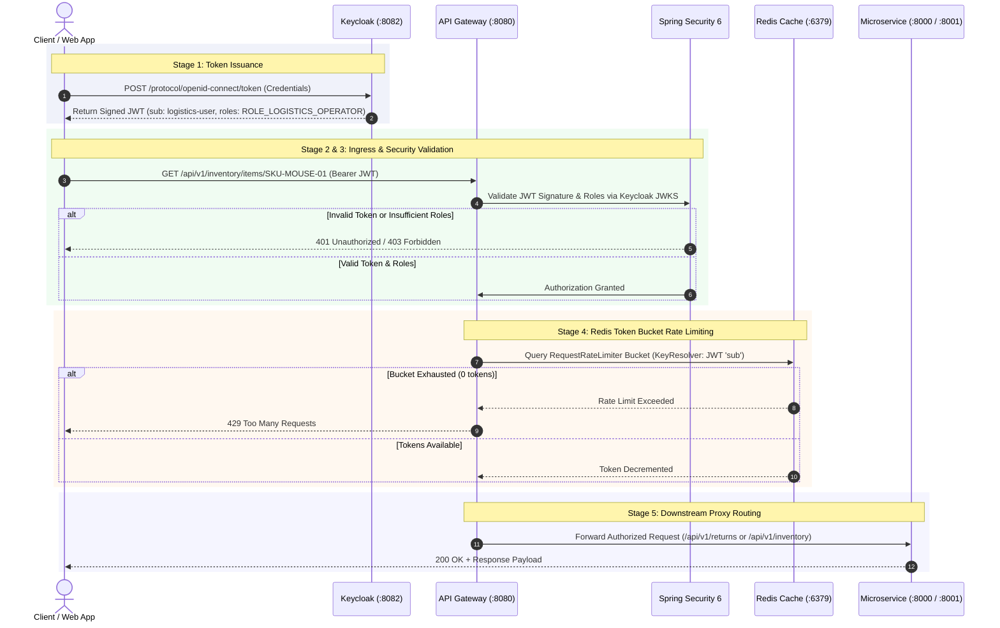

# ADR 0007: Reactive API Gateway Edge Ingress, OAuth2 JWT Security, and Redis Rate-Limiting

* **Status:** Accepted
* **Date:** 2026-10-05
* **Deciders:** James Hayes (Staff Engineer)
* **Technical Domain:** Edge Ingress, Security & Traffic Management

---

## 1. Context & Problem Statement
Exposing internal microservices directly to public clients introduces significant security, operational, and traffic governance risks:
1. Public clients would need to handle individual service locations, ports, and authentication headers.
2. Ingress endpoints risk abuse from DDoS attacks, brute-force attempts, or runaway client loops without token bucket rate limiting.
3. Authenticating JWTs inside every individual microservice creates duplicate security boilerplate and increases processing overhead across internal service boundaries.

---

## 2. Decision Drivers & Forces
* **Unified Edge Ingress:** Provide a single entry point (`:8080`) that dynamically routes client requests to downstream reactive services based on URI predicates.
* **Non-Blocking Resilience:** Maintain strict non-blocking reactive thread execution across the gateway proxy using Spring Cloud Gateway and Netty.
* **Centralized Security Offloading:** Validate OAuth2 JWT tokens at the edge and enforce Role-Based Access Control (RBAC) before requests hit internal microservices.
* **Distributed Rate Limiting:** Enforce distributed, non-blocking token-bucket rate limits per client identifier backed by Redis.

---

## 3. Options Considered
1. **Direct Service Ingress (No Gateway):** Public clients invoke individual microservices directly. High security risk and operational overhead.
2. **Imperative Gateway (Spring Cloud Gateway MVC / Zuul 1.x):** Servlet-based blocking gateways. Susceptible to thread exhaustion under heavy ingress concurrency.
3. **Reactive Spring Cloud Gateway + Redis Token Bucket + Spring Security 6:** Fully non-blocking event-loop gateway integrated with Reactive Redis and OAuth2 JWT Resource Server validation.

---

## 4. Decision Outcome
**Chosen Option:** Option 3 — Reactive Spring Cloud Gateway Stack.

### Component Architecture & Responsibilities

| Component | Technology / Port | Purpose & Use | Core Architectural Benefit |
| :--- | :--- | :--- | :--- |
| **API Gateway** | Spring Cloud Gateway / Netty (`:8080`) | Single entry point routing `/api/v1/returns/**` to `:8000` and `/api/v1/inventory/**` to `:8001`. | Hides internal service topology; non-blocking event loop handles high concurrency. |
| **Identity Provider** | Keycloak OIDC (`:8082`) | Issues signed OAuth2 JWT tokens containing user identities and roles (`ROLE_CUSTOMER`, `ROLE_LOGISTICS_OPERATOR`). | Centralizes identity management and user authentication outside of application code. |
| **Edge Security** | Spring Security 6 Reactive Resource Server | Intercepts ingress traffic, verifies JWT signatures via JWKS, and enforces RBAC endpoint security rules. | Offloads auth validation from downstream microservices, keeping domain services focused purely on business logic. |
| **Rate Limiter** | Redis (`:6379`) + `RequestRateLimiter` Filter | Tracks token buckets in-memory to limit client request throughput (e.g., 10 req/sec, burst capacity 20). | Protects downstream services and database connection pools from flood surges and DDoS attacks. |
| **Key Resolver** | `RateLimiterConfig` Bean | Determines rate-limiting bucket key: 1) `X-API-Key` header -> 2) Authenticated JWT `sub` -> 3) Remote Client IP. | Ensures fair usage per client or user identity rather than blanket IP throttling. |
| **Observability** | Spring Boot Actuator (`:8080`) | Exposes health checks (`/actuator/health`) and metrics scraping (`/actuator/prometheus`). | Enables automated health monitoring and Prometheus/Grafana metric collection. |

---

### Step-by-Step Request Execution Flow

---

## 5. System Consequences & Trade-offs

### Positive
* **Attack Surface Reduction:** Internal microservices (`:8000`, `:8001`, `:8006`) are shielded behind a private network boundary; only `:8080` is exposed to public traffic.
* **Centralized RBAC Enforcement:** Downstream services receive pre-validated, token-authenticated requests, reducing security handling overhead inside domain boundaries.
* **Traffic Protection:** Distributed token bucket algorithm drops excess request floods with `429 Too Many Requests` responses before they hit internal databases.

### Negative & Mitigation
* **Single Point of Ingress Failure:** If `api-gateway` goes down, public traffic cannot reach the ecosystem.
  * *Mitigation:* Deploy `api-gateway` as a stateless horizontally scalable cluster behind a cloud load balancer (AWS ALB or NGINX).
* **Redis Operational Dependency:** Rate limiting depends on Redis availability.
  * *Mitigation:* Configured fallback behavior allowing traffic flow if Redis becomes transiently unreachable, preserving system availability over strict throttling.